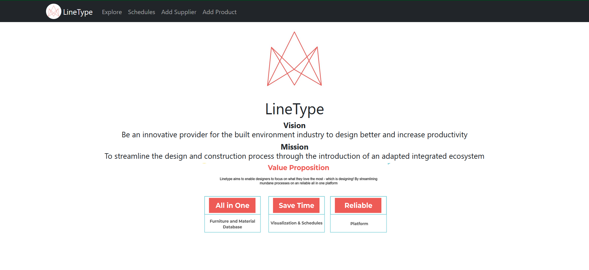

# LineType

This project is built on top of React JS.

Before running this project, please set up the configuration variables in ./src/firebase.js.
Use `npm start` to run the project.

## These are the pages you should be able to see:

### Landing Page

### Explore Page

- click on the product name to see the Product Page
- click on the download link to download the model file for that product
- add the product to a schedule by choosing a schedule from the dropdown box, also specify quantity of the product to be added to the schedule

### Product Page

- shows details of the product
- download button for the product model

### Add Product Page

- Navigate here for the navbar
- model file can be of type .dwg, .stl, .3ds, .obj, or .skp.
- choose an existing supplier or go to Add Supplier Page to add a new supplier

### Add Supplier Page

- Add all details of the new supplier
- form will be rejected if supplier with given name already exists in the database

### Schedules Page

- View all schedules created here
- Create a new schedule with description using the form below the page title (with a name that does not already exist in the database)
- Click on see details for to see the Schedule Page

### Schedule Page

- This page shows a schedule with the products and quantities added to it